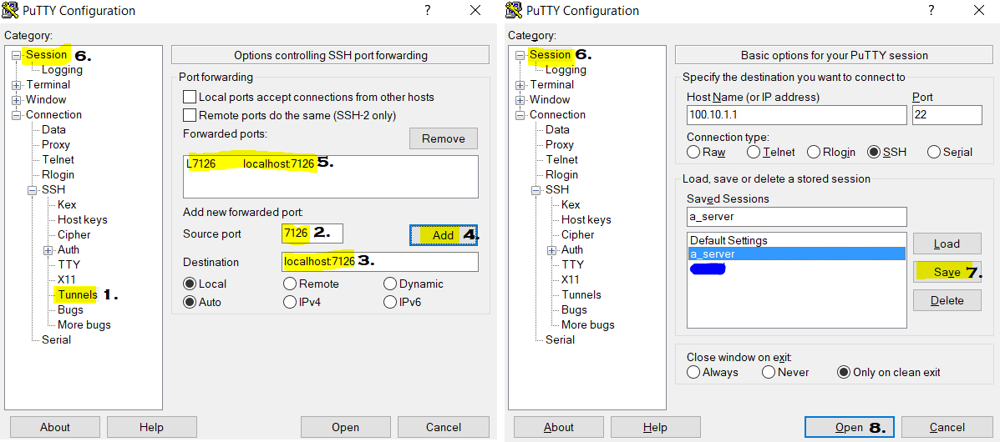

__Brian Blaylock__  
__July 2018__  
__[Website](http://home.chpc.utah.edu/~u0553130/Brian_Blaylock/home.html)__

# pyBKB_v3
These scripts help me be a successful meteorologist and were primarily used throughout my Ph.D. research at the University of Utah 2017-2019. 

> _Learn Python: _
> There are a lot of resources online to learn Python. 
> - ATMOS 5020 I helped taught: https://github.com/johnhorel/ATMOS_5020_2019
> - This course by Microsoft and NASA cover several basics and can get you started: https://docs.microsoft.com/en-us/learn/paths/introduction-python-space-exploration-nasa/


# Anaconda Environment
> Please read the documents for managing environments.  
> Reference: https://docs.conda.io/projects/conda/en/latest/user-guide/tasks/manage-environments.html
> Reference: https://github.com/Unidata/unidata-users-workshop  

I installed the Anaconda python distribution and created a new environment using the `environment.yml` file provided in this directory. The name of the environment is **pyBKB_v3** named after my initials and v3 indicates that these were written for Python 3 (as opposed to pyBKB_v2 which are older scripts written when I used Python 2).

    conda env create -f ./environment.yml

> NOTE: `pygrib` was recently made available on Windows.

On a windows computer, to activate the `pyBKB_v3` environment, do this in the Windows Command Prompt:

    activate pyBKB_v3

Or, if you are in the PowerShell

    cmd
    activate pyBKB_v3

If you are using a `bash` shell in Linux:

    conda init bash  # Only need to do this once to initialize the correct shell
    conda activate pyBKB_v3

If you are using a `tcsh` shell in Linux:

    conda init tsch  # Only need to do this once to initialize the correct shell
    conda activate pyBKB_v3


## Update environment
Deactivate the environment

    conda deactivate pyBKB_v3

Update the environment.yml file, and update the conda environment

    conda env update -f environment.yml

List all the available environments

    conda info --envs

---
## How to use these modules
`pyBKB_v3` is kept in `$HOME/pyBKB_v3`. One way to use these modules into your scripts is to append the sys path in your script.

```python
import sys
sys.path.append('/path/to/folder/pyBKB_v3')

# Load some module from pyBKB_v3
import BB_mesowest
```

But that is a little cumbersome when you just want to get started quick.

Instead, you can update the `PYTHONPATH` variable in your environment to automatically append the path. I inserted the following into my `.bashrc` file.

```bash
export PYTHONPATH=$HOME/pyBKB_v3:$PYTHONPATH
```

After that variable is applied, when you open python and print out the value of `sys.path`, you will see that the pyBKB_v3 directory is included. This means that a simple ```module load BB_mesowest``` in your python script will load the module. **This is an important change to know if you are not Brian and you are using these modules, as some of my scripts assume the PYTHONPATH as been set while others will explicily append the sys.path.**

---

I primarily use Jupyter Lab and VS Code to write and run code. Here are some tips for running Jupyter Lab and VS Code on a remote server...

## Tunnel Jupyter Lab through Putty
Jupyter Lab is included in my `environment.yml` file. When running Jupyter Lab on a remote computer, you can tunnel Jupyter to your local browser window.

To configure Putty for an SSH Tunnel...

1. In the left, click `Connection` > `SSH` > `Tunnels`
2. In the source port, replace #### with a port number you chose between 7000 and 8000.
3. In the destination, add `localhost:####`
4. Click `Add`
5. Confirm that you see `L####   localhost:####` in the list of forwarded paths.
6. REMEMBER TO SAVE THE SESSION!



Now, on the remote machine, run Jupyter Lab

    jupyter lab --no-browser --port=####

Jupyter will fire up and provide a URL and token you can copy and paste into your local browser. Something like this...

    copy and paste the URL:
        http://localhost:####/?token=.........

I added an alias to my ~/.bashrc file on my remote machine as a short cut

    alias jupy='cd / && jupyter lab --no-browser -port=7686

Note that I first change to the root direcotry, `cd /`, so I have access to the full system rather than just being confined to the directory I open Jupyter.

## VSCode on a remote server with `code-server`
Jupyter Lab is great for notebooks, but often I need a more powerful and mature code editor. That is when I turn to VS Code. Sometimes it's difficult to install VS Code on a remote server, but you can run `code-server` and through an SSH tunnel in Putty. This lets you run a version of VS Code on the remote server and view in your local browser (similar to tunneling Jupyter, as shown above).

> # 👉🏻 https://github.com/cdr/code-server

#### Set up SSH Tunnel
Set up an SSH Tunnel following the instructions above. Remember the port number...you will need that later.

#### Install code-server via conda
On the remote server, install code-server via conda (the easiest way): https://anaconda.org/conda-forge/code-server. I put this in it's own environment for now. Then, activate the new environment.
    
    conda create -n vscode -c conda-forge code-server
    conda activate vscode

#### Configure code-server
Start code-server for the first time in the command line. Type the following in the terminal...
    
    code-server

This first time running code-server creates a default config file. The screen output tells you where that config file is located. `Wrote default config file to ~/.config/code-server/config.yaml`. You will need to edit that file. 

In that config file change **auth: password* with **auth: none**.  Also, change the port in the bind-addr to a port number you set up in the putty ssh tunnel. **bind-addr: 127.0.0.1:####** For example, my config file looks like this, which forwards through port 7684
    
    ~/.config/code-server/config.yaml
    bind-addr: 127.0.0.1:7684
    auth: none
    password: SomePasswordHereThatIsNotUsed
    cert: false

#### Start code-server and open
Restart code-server on the remote server and open in your local browser. In a browser like Chrome, navigate to the following URL:

    http://127.0.0.1:7684    <-- change the last 4 numbers to your port number

And there you go...you have an instance of VS Code running. In Chrome, you can install pages as an "app" and that is what I did with my instance of code-server and Jupyter Lab and pinned them to the task bar for quick acess.
