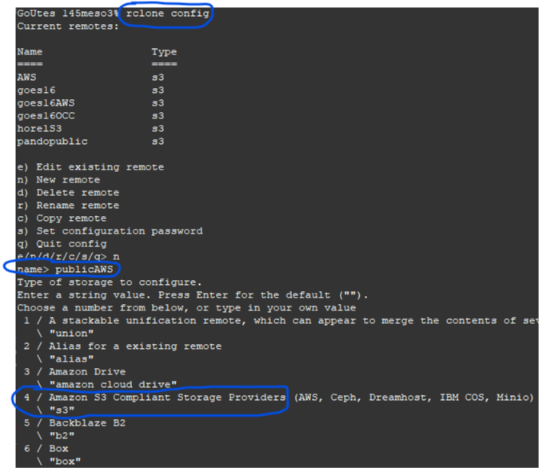

Brian Blaylock  
October 10, 2018

# How to use `rclone` to access GOES16, HRRR, and NEXRAD on Amazon AWS

As part of NOAA's Big Data Project, Amazon makes available NEXRAD, GOES, HRRR, and other data publicly available via Amazon Web Services (AWS). You can use `rclone` to access this data and download for your use. (You can even use rclone to access personal OneDrive, Google Drive, Box, and other types of cloud storage.)

## 1. Download and install `rclone` on your linux machine

https://rclone.org/

## 2. Configure `rclone` to access **Amazon S3**
After `rclone` has been downloaded and installed, configure a remote by typing `rclone config`. Then type `n` for `new remote`.

Name the remote anything you like, but use a name that will remind you it accesses the public Amazon S3 buckets. I named mine `publicAWS`. 

Set _Type of Storage_ as `Amazon S3 Compliant Storage Providers` which is **option 4** for me.


Set _Storage Provider_ as `Amazon Web Services S3` which is **option 1** for me.

Leave everything else blank (push enter for the remaining prompts).

The prompt will ask you if something like following is correct:

    [publicAWS]
    type = s3
    provider = AWS
    env_auth =
    access_key_id =
    secret_access_key =
    region =
    endpoint =
    location_constraint =
    acl =
    server_side_encryption =
    storage_class =

If it looks right, accept with `y` and exit the setup.

This configuration is saved in the `~/.config/rclone.config` file.

## 3. `rclone` access to public buckets
You will use the remote you just set up to access NOAA's public buckets on Amazon Web Services S3. Below are the names of some of NOAA's public buckets. 

|Data| Bucket Name| Documentation |
|--|--|--|
|GOES16| `noaa-goes16`| [link](https://registry.opendata.aws/noaa-goes/) |
|GOES17| `noaa-goes17`| [link](https://registry.opendata.aws/noaa-goes/) |
|NEXRAD| `noaa-nexrad-level2`| [link](https://registry.opendata.aws/noaa-nexrad/) |
|HRRR| `noaa-hrrr-bdp-pds`| [link](https://registry.opendata.aws/noaa-hrrr-pds/) |

> Note: **bdp-pds** stands for Big Data Program Public Data Set

You access the bucket contents by typing the command `rclone [command and options] [remote name]:[bucket name]`. Documentation for all the commands and options can be found on the [rclone](https://rclone.org/) website.

### List directories and files

    # List bucket directories
    rclone lsd publicAWS:noaa-goes16/
    
    # List bucket directories for specific folders
    rclone lsd publicAWS:noaa-hrrr-bdp-pds/hrrr.20210101

    # List files in bucket
    rclone ls publicAWS:noaa-hrrr-bdp-pds/hrrr.20210101/conus

### Copy file or files to your local machine

    rclone copy publicAWS:noaa-goes16/ABI-L2-MCMIPC/2018/283/00/OR_ABI-L2-MCMIPC-M3_G16_s20182830057203_e20182830059576_c20182830100076.nc ./

---

## Note: Access to HRRR archive on Pando
The remote gateway for Pando is https://pando-rgw01.chpc.utah.edu. You could config rclone to access HRRR on Pando with
```
[horelS3]
type = s3
provider = Ceph
env_auth = false
endpoint = https://pando-rgw01.chpc.utah.edu
```
Then look at the bucket with `rclone lsd horelS3:hrrr/`


---
---


# How to use rclone with Python

I like to use `rclone` to list and access the files within my Python scripts.

To run a basic `rclone` command within Python, you might use `os.system()`

    import os
    os.system('rclone copy publicAWS:noaa-goes16/.../.../etc. ./this_path_on_my_machine/')

If you want to capture the ouput, such as file names, you might consider using `subprocess`.

    import subprocess
    
    # Get output from rclone command
    files = subprocess.check_output('rclone lsd goes16AWS:noaa-goes16', shell=True)

    # Change type from 'bytes' to 'string'
    files = files.decode()

    # Split files based on the new line and remove the empty item at the end.
    files = files.split('\n')
    files.remove('')

Alternatively, you can use `subprocess.run()`.

     a = subprocess.run(['echo','hi'], stdout=subprocess.PIPE).stdout.decode().split('\n')
     a.remove('')

